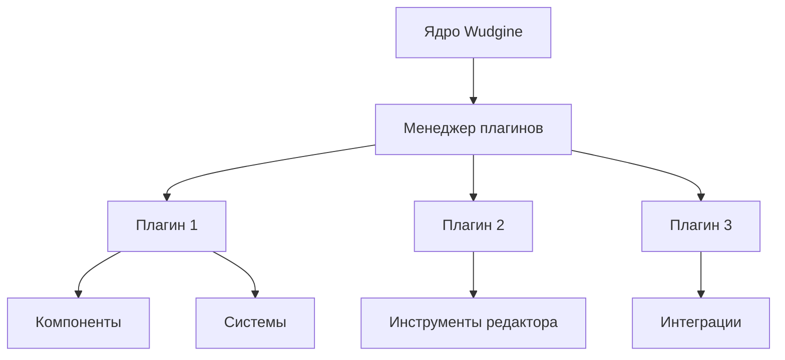

::alert{type="info"}
Система плагинов Wudgine позволяет расширять функциональность движка без изменения его основного кода.
::

## Что такое плагины в Wudgine?

Плагины в Wudgine — это модули, которые можно подключать к вашему проекту для добавления новых возможностей или изменения существующего поведения движка. Они позволяют:

- Добавлять новые компоненты и системы
- Расширять функциональность редактора
- Интегрировать сторонние библиотеки и инструменты
- Создавать собственные инструменты для оптимизации рабочего процесса

## Преимущества использования плагинов

::list{type="success"}
- **Модульность**: подключайте только те функции, которые нужны вашему проекту
- **Гибкость**: настраивайте поведение движка под свои потребности
- **Совместимость**: обновляйте движок без потери собственных расширений
- **Переиспользование**: делитесь своими решениями с сообществом
::

## Типы плагинов

В Wudgine существует несколько типов плагинов:

::card-grid
#title
Категории плагинов

#root
:ellipsis

#default
  ::card{icon="ph:puzzle-piece"}
  #title
  Компонентные плагины
  #description
  Добавляют новые компоненты для игровых объектов, расширяя их возможности.
  ::

  ::card{icon="ph:gear"}
  #title
  Системные плагины
  #description
  Внедряют новые системы в игровой цикл для обработки компонентов или других аспектов игры.
  ::

  ::card{icon="ph:pencil-simple"}
  #title
  Плагины редактора
  #description
  Расширяют функциональность редактора Wudgine, добавляя новые инструменты и панели.
  ::

  ::card{icon="ph:globe"}
  #title
  Интеграционные плагины
  #description
  Обеспечивают взаимодействие с внешними сервисами, библиотеками и API.
  ::
::

## Архитектура системы плагинов

Система плагинов Wudgine построена на принципах:

1. **Слабой связанности**: плагины взаимодействуют с движком через четко определенные интерфейсы
2. **Контроля жизненного цикла**: каждый плагин имеет определенные этапы инициализации, работы и завершения
3. **Управления зависимостями**: плагины могут зависеть от других плагинов и автоматически загружать их
4. **Безопасности**: система изоляции предотвращает нежелательное влияние плагинов на основной код



## Начало работы с плагинами

Для начала работы с плагинами вам потребуется:

1. **Установить плагин** — через менеджер плагинов или вручную
2. **Активировать плагин** — в настройках проекта
3. **Настроить плагин** — если требуется, через его интерфейс настроек

::code-group
```cpp [Подключение плагина в C++]
#include "Wudgine/Core/PluginManager.h"

// В вашем коде инициализации
auto& pluginManager = Wudgine::Core::PluginManager::GetInstance();
pluginManager.LoadPlugin("MyAwesomePlugin");

// Проверка успешной загрузки
if (pluginManager.IsPluginLoaded("MyAwesomePlugin")) {
    // Плагин успешно загружен
    auto* plugin = pluginManager.GetPlugin("MyAwesomePlugin");
    plugin->Initialize();
}
```

```json [Конфигурация плагинов в проекте]
{
  "project": {
    "name": "MyGame",
    "plugins": [
      {
        "name": "MyAwesomePlugin",
        "version": "1.0.0",
        "enabled": true,
        "config": {
          "customOption1": true,
          "customOption2": "value"
        }
      }
    ]
  }
}
```
::

## Что дальше?

В следующих разделах вы узнаете:

- [Как создавать собственные плагины](/plugins/creating-plugins)
- [API плагинов и доступные хуки](/plugins/plugin-api)
- [Примеры готовых плагинов](/plugins/plugin-examples)
- [Как публиковать плагины](/plugins/publishing-plugins)

::alert{type="success"}
Система плагинов Wudgine позволяет вам не только использовать готовые решения, но и создавать собственные инструменты, которые могут быть полезны всему сообществу!
::
